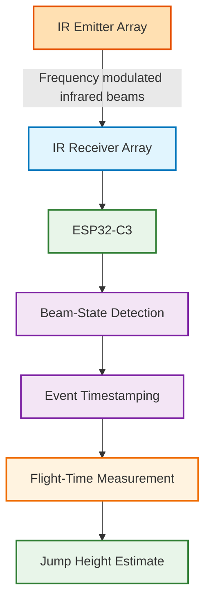

# optical-jump-measurement-system

A custom infrared-based system for measuring athlete flight time and estimating jump height.

The project is being developed as an engineering learning project and as an exploration of a potential future product specifically in the egyptain market.

## Project Goals

- Detect take-off and landing using infrared beam interruption
- Improve resistance to sunlight and ambient optical interference
- Measure flight time with high timing resolution
- Estimate jump height from flight time
- Develop custom embedded hardware and firmware
- Build a rechargeable battery-powered system

## Current Architecture

## Current Hardware

Current development includes:

- ESP32-C3 microcontroller
- 940 nm infrared emitters
- infrared receivers
- USB-C
- rechargeable Li-ion battery system
- 3.3 V regulated power architecture
- custom PCB development in KiCad

## Engineering Challenges

### Ambient Light Rejection
The system uses modulated infrared rather than constant illumination to improve rejection of sunlight and external light sources.

### Optical Crosstalk
Current development is investigating receiver spacing, emitter geometry, optical isolation and channel behaviour.

### Timing Accuracy
Reliable take-off and landing detection is critical because jump height is estimated from flight time.

## Current Status

Early hardware development / prototype design.

Current work includes:

- multi-channel receiver prototyping
- optical crosstalk testing
- PCB placement optimisation
- receiver timing characterisation
- embedded firmware development

## Development Log

### September 2026

- Selected ESP32-C3 as the main controller
- Selected 940 nm IR emitter architecture
- Evaluated integrated IR receivers 
- Developed initial rechargeable power architecture
- Created first custom PCB layout
- Began redesigning PCB placement around optical, RF and mechanical constraints

## Tools

- KiCad
- ESP32-C3
- C/C++
- Git
- GitHub

## Project Status

This project is actively under development.

This public repository documents development progress, engineering decisions and test results. Detailed implementation files are maintained privately.
